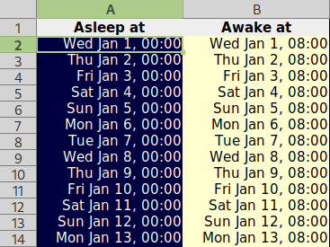

# Supported formats

[The Zeitlog dashboard](https://zeitlog.github.io/) can read the following formats:

- :material-file-star-outline: &nbsp; [Standardised diary format](https://github.com/zeitlog/core/tree/main/src/Standard)
- :material-cellphone: &nbsp; [Sleepmeter](https://github.com/zeitlog/core/tree/main/src/Sleepmeter)
- :material-android: &nbsp; [Sleep as Android](https://github.com/zeitlog/core/tree/main/src/SleepAsAndroid)
- :material-cellphone: &nbsp; [Plees Tracker](https://github.com/zeitlog/core/tree/main/src/PleesTracker)
- :material-chart-box-outline: &nbsp; [SleepChart 1.0](https://github.com/zeitlog/core/tree/main/src/SleepChart1)
- :material-format-list-bulleted: &nbsp; [Activity Log](https://github.com/zeitlog/core/tree/main/src/ActivityLog)
- :material-watch: &nbsp; [Fitbit](https://github.com/zeitlog/core/tree/main/src/Fitbit)
- :material-table: &nbsp; [Spreadsheet Table](https://github.com/zeitlog/core/tree/main/src/SpreadsheetTable)
- :material-chart-box: &nbsp; [Spreadsheet Graph](https://github.com/zeitlog/core/tree/main/src/SpreadsheetGraph)

!!! question "Format not working?"
    - If your format is listed above but [the dashboard](https://zeitlog.github.io/) can't load it, [open a bug report](https://github.com/zeitdex/zeitdex.github.io/issues/new?assignees=&labels=bug&template=bug_report.md&title=) — but check the spreadsheet tips below first.
    - If your format isn't listed, [request it](https://github.com/zeitdex/zeitdex.github.io/issues/new?assignees=&labels=&template=feature_request.md&title=).

## Hand-made spreadsheets

[{ .right width="220" }](SleepTable.xlsx)

We support spreadsheets created as both *tables* (lists of dates) and *graphs* (coloured blocks). A few tips to make sure we can read your diary:

- Upload files in `.xlsx` format where possible.

    - `.csv` tables are supported, but you may need to change dates to [ISO 8601 format](https://en.wikipedia.org/wiki/ISO_8601).
    - `.ods` files aren't currently supported, but LibreOffice can save a copy in *Excel 2007-365* format.

- If your original file doesn't work, try copying the relevant bits into [the example table](SleepTable.xlsx) or [the example graph](SleepGraph.xlsx) and uploading that.
- Make sure your spreadsheet isn't storing dates as text — text is left-aligned by default, dates are right-aligned.

[:material-download: Example table](SleepTable.xlsx){ .md-button }
&nbsp;
[:material-download: Example graph](SleepGraph.xlsx){ .md-button }
