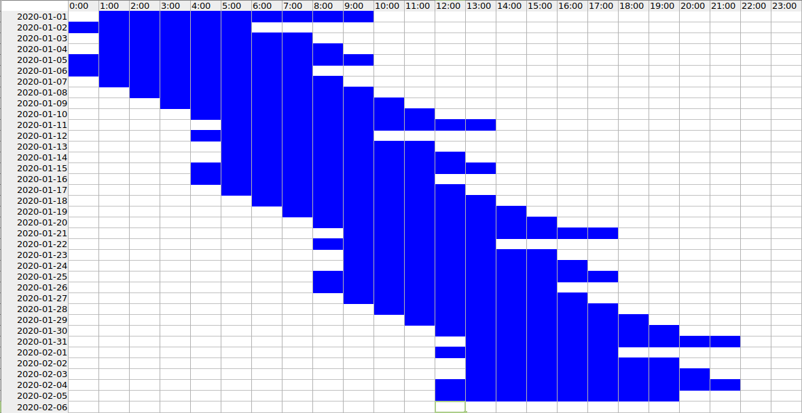

# Supported formats

[The Zeitlog dashboard](https://zeitlog.github.io/) can read the following formats:

- [Standardised diary format](https://github.com/zeitlog/core/tree/main/src/Standard)
- [Sleepmeter](https://github.com/zeitlog/core/tree/main/src/Sleepmeter)
- [Sleep as Android](https://github.com/zeitlog/core/tree/main/src/SleepAsAndroid)
- [Plees Tracker](https://github.com/zeitlog/core/tree/main/src/PleesTracker)
- [SleepChart 1.0](https://github.com/zeitlog/core/tree/main/src/SleepChart1)
- [Activity Log](https://github.com/zeitlog/core/tree/main/src/ActivityLog)
- [Fitbit](https://github.com/zeitlog/core/tree/main/src/Fitbit)
- [Spreadsheet Table](https://github.com/zeitlog/core/tree/main/src/SpreadsheetTable)
- [Spreadsheet Graph](https://github.com/zeitlog/core/tree/main/src/SpreadsheetGraph)

- If your format is in the list above but [the dashboard](https://zeitlog.github.io/) can't load it, [let us know](https://github.com/zeitdex/zeitdex.github.io/issues/new?assignees=&labels=bug&template=bug_report.md&title=) — but see the tips below first if it's a hand-made spreadsheet.
- If your format isn't in the list above, [contact us](https://github.com/zeitdex/zeitdex.github.io/issues/new?assignees=&labels=&template=feature_request.md&title=).

## Hand-made spreadsheets

[{ width="220" }](SleepTable.xlsx)
[{ width="220" }](SleepGraph.xlsx)

We try to support spreadsheets created as both *tables* (lists of dates) and *graphs* (coloured blocks). Here are some tips to make sure we can read your diary:

- Upload files in `.xlsx` format where possible.
    - `.csv` tables are supported, but you may need to change your dates to [ISO 8601 format](https://en.wikipedia.org/wiki/ISO_8601).
    - `.ods` files are not currently supported, but LibreOffice can save a copy in *Excel 2007-365* format.
- If your original file doesn't work, try copying the relevant bits into [the example table](SleepTable.xlsx) or [the example graph](SleepGraph.xlsx) and uploading that.
- Make sure your spreadsheet isn't storing dates as text.
    - Text is left-aligned by default, dates are right-aligned.
