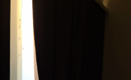
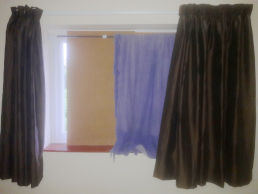
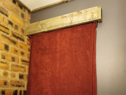
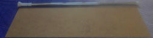
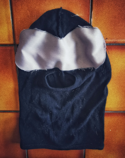

# Block out sunlight

Minimising your exposure to sunlight while you're in bed can drastically improve your quality and quantity of sleep. This page discusses several solutions to use directly or as inspiration for your particular situation.

## Blackout curtains

[{ .right width="220" }](blackout-curtains.jpg)

[Blackout fabric](https://en.wikipedia.org/wiki/Blackout_(fabric)) is a light, thin material that keeps a room far darker than ordinary curtains. Here are some common solutions that use blackout fabric.

**Blackout curtains** can work well, and may feel more like a normal bedroom. But even a tiny sliver of daylight can disrupt the illusion of night-time. Sealed blackout blinds provide the best guarantee, but a professional fitter should be able to block out light even with normal blinds. Just make sure they fit the curtain flush against the sides, and add a box pelmet to block light at the top (as shown in the image).

**Blackout roller blinds** are a cheaper alternative. Replace your existing curtains or blinds with fabric you can roll down when you go to bed and roll back when you wake up. Because the roller screws into the wall, you should get a very close fit even if you attach it yourself. But make sure to check with your landlord before making such a permanent modification.

**No-drill blackout blinds** are a decent alternative if you can't make permanent modifications. These stretch a bar across the recess your window sits in, which can then be used like a normal roller blind.

**Blu-tac blinds** are an even lower-tech alternative — just buy a roll of fabric online and fix it to the window with blu-tac. This is cheaper than the alternatives and works even with bay windows. But it can be cumbersome and you need to be careful not to leave blu-tac anywhere that might leave a mark.

### Strengths and weaknesses

Blackout fabric is very effective, gives a professional-looking result, and can be applied with no more skill than it takes to hang up a poster.

Different solutions have different costs, and it can be particularly expensive if you have large windows and specific requirements. But expense is not a sign of quality — try to get a fabric sample before making a large purchase, to make sure the material is as effective as claimed.

Solutions that are easier to put up are also more likely to come down accidentally. Blu-tac blinds will soon unstick, and a no-drill bar will eventually slip free. You can just reset them when that happens, but it can be an unpleasant interruption if it happens while you're asleep.

Blackout curtains can also help manage the temperature in your bedroom. Open your bedroom door and windows at night to let cool air in, then close them and draw the curtains before dawn to keep warm air out. You should find your room is several degrees cooler even if your primary sleep is in the mid-afternoon.

## Home-made barriers

[{ .right width="220" }](curtains.jpg)

If blackout blinds aren't appropriate, there are a variety of alternatives you can make yourself. This section describes some barriers to sunlight that combine to provide good protection.

**Hard sheets of material**. These block a lot of light, but leave gaps that disrupt the illusion of night-time. This can be as simple as some old cardboard boxes, but you might find they leave too many slivers of light. Proper cardboard sheets are cheap and available online. Other materials work fine (like hardboard), but tend to be more expensive for no extra benefit.

[{ .right width="220" }](box-pelmet.jpg)

**DIY box pelmet**. These block light from escaping over the top of a curtain rail. A box pelmet is essentially just a few planks of wood attached to a wall with a keyhole hanger, so anyone with moderate DIY skill should be able to make one using an online tutorial.

**Heavy fabrics**. Most fabrics let in too much light to be useful on their own, but are a fine way to cover the cracks in a cardboard curtain. A thick blanket should work fine, as will any similar material you have available. But avoid anything too precious, as it will gradually be bleached by the sun.

### Strengths and weaknesses

[{ .right width="220" }](barriers.jpg)

These solutions can almost eliminate sunlight from a room at low- or zero-cost, and can be adapted for many different types of window.

Fabrics need to be placed carefully to work well. You can try draping them over a hard sheet of material, but there might be gaps and they might be too heavy for cardboard to hold up. If your window sits in a recess, you can attach some kind of rail to hold them — recess brackets and a curtain rail are best, but a pull-up bar (like you would use for exercising) is a no-drill solution that can hold a lot of weight and should only fall down once every few years.

One important weakness is that home-made barriers can make it difficult to see your window at all. As well as not seeing out of the window, you're less likely to notice problems like mould. You should try to take the barriers down regularly, to clean the fabric and wash the windows. Depending on your location, you might need to do this as much as once a month or as little as once a year.

## Sleep masks

[{ .right width="220" }](ski-mask.jpg)

If you can't darken your bedroom at all, a last resort is to at least stop sunlight getting into your eyes. This section discusses some ways to achieve that.

**Sleep masks** are small pieces of fabric to cover your eyes at night. They're widely available online, but can easily come off during the night.

**Blackout balaclavas** are a more effective home-made solution — just sew a small piece of blackout fabric over the eyeholes in a balaclava. These provide much better protection and are less likely to come off, but are a little more work for a little less comfort.

### Strengths and weaknesses

Sleep masks are the most flexible way to block sunlight during sleep. They take up almost no room in a suitcase, and work even if your partner needs a sunny bedroom.

Sleeping in a mask can be hot and uncomfortable, which is counterproductive if your goal is to maximise your quality of sleep. These can be better than nothing, but aren't really a long-term solution.
